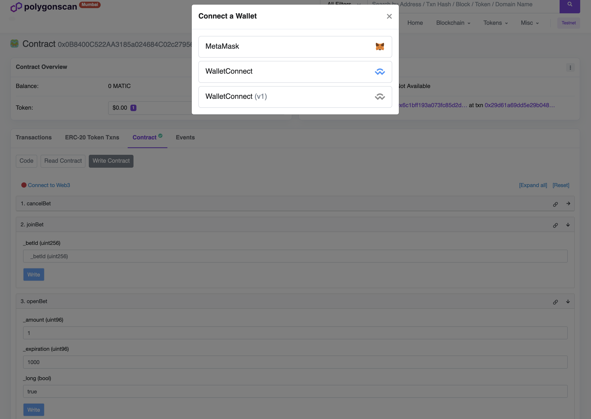

## How to run app

Just past and execute the command below in your terminal.
```shell
	cd backend && docker-compose up
```

And then run this command in another terminal.
```shell
	make migrate-up
```

## How to interact with the contracts
Contracts are located in the contracts directory and include deploy script and unit tests.
Now you can interact with the smart contract, you will see logs in the console

```shell
ERC20Mock address: 0x2c8a8530C9c104444bD9563a4Eb0822984a66ba4
Wager address: 0x0B8400C522AA3185a024684C02c2795654275f20
```

Firstly, you need to mint yourself tokens, it can be done via
https://mumbai.polygonscan.com/address/0x2c8a8530C9c104444bD9563a4Eb0822984a66ba4#writeContract
you can connect your wallet and mint tokens, then give approve to the wager contract

Once approved head to the wager contract and create a bet and join it, you'll see the logs in the console
https://mumbai.polygonscan.com/address/0x0B8400C522AA3185a024684C02c2795654275f20#writeContract


